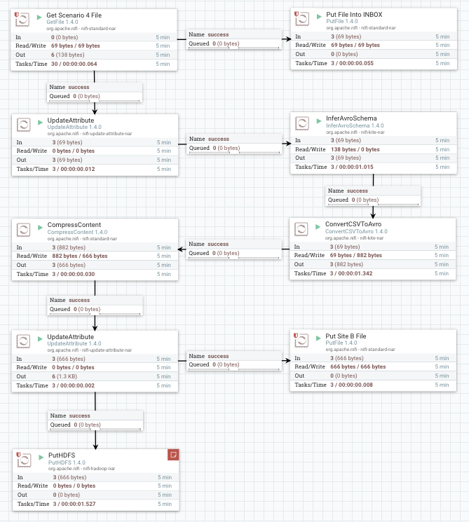
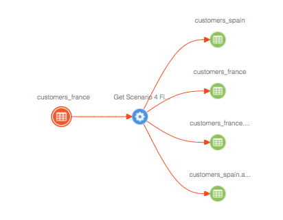
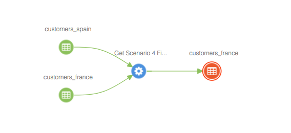
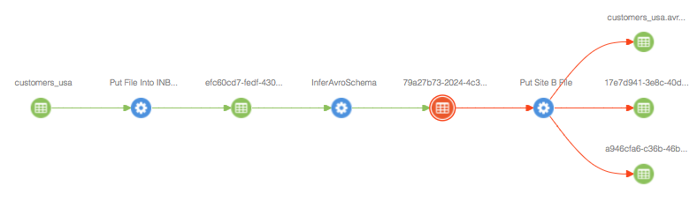
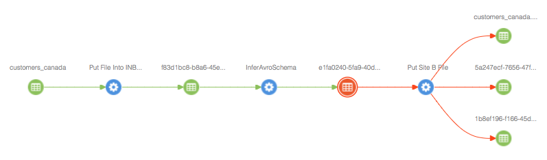

# NiFi Atlas Lineage Reporting Strategy

This is a comparison of the two strategies configurable in the NiFi Atlas Reporter.  The
reporter supports two variations: By Path and By File.

The flow we will use in this example:

*Wait for a file in a landing folder, take the file, derive the Avro Schema,
convert the file contents to Avro format, compress the file and write it to an HDFS.*

# By Path Strategy

We will first look at the By Path strategy of the Nifi Atlas Reporter, implemented in NIFI branch nifi-3709-2.

Two files will be deposited into the landing folder:
- customers_france
- customers_spain

The results in Atlas look like the following:

As expected, there is one Atlas process representing the NiFi flow path.

And when we look at the impact, we can select 'customers_france.avro.gz', and see:

From a process point of view, it accurately represents the flow of these files from source to destination.

But contrary to the lineage diagram above, the 'customers_france.avro.gz' file did not actually
get any data from the 'customers_spain' file.

# By File Strategy

We will now look at the By File strategy of the NiFi Atlas Reporter.

Taking the same Nifi Flow, we will deposit into the landing folder:
- customers_usa
- customers_canada

In this case, we get two lineages in Atlas:

One representing customers_usa:

One representing customers_canada:

The use case for the "By File" strategy would be when it is important to:

- track lineage over time; so if processes change over time, Atlas can track this change
- track the flow of files and their impacts
